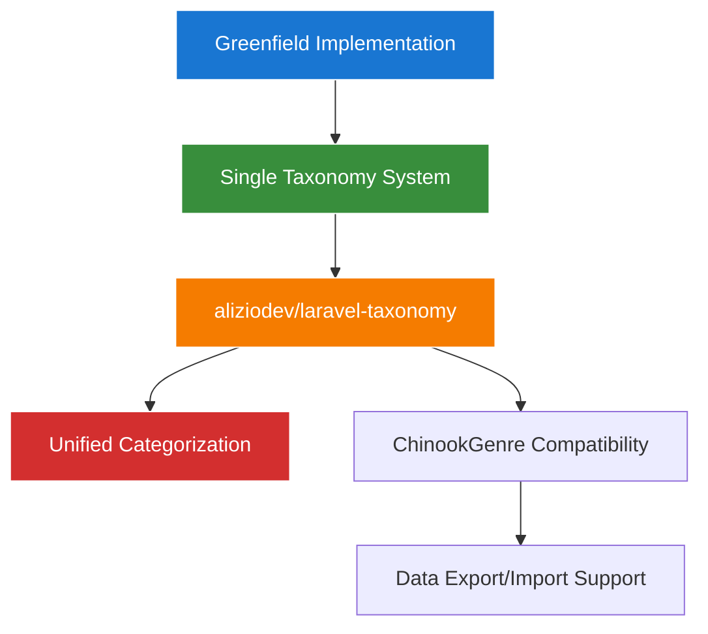
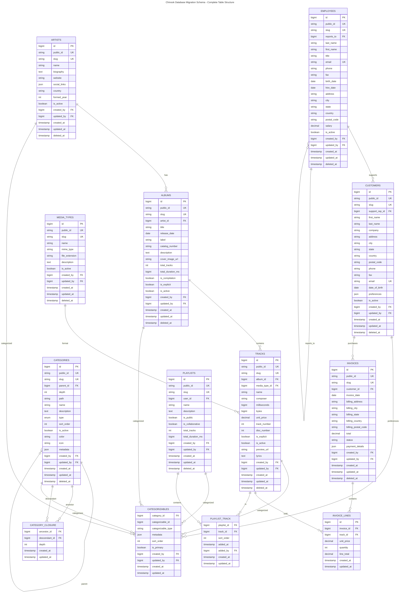

# Chinook Database Schema Guide
## ✅ Greenfield Single Taxonomy System Implementation

## Table of Contents

- [Overview](#overview)
- [Prerequisites](#prerequisites)
- [Schema Creation Order](#schema-creation-order)
    - [Dependency Order](#dependency-order)
    - [Generate Migration Commands](#generate-migration-commands)
- [Schema Implementations](#schema-implementations)
    - [Database Schema Overview](#database-schema-overview)
    - [Artists Migration](#artists-migration)
    - [Taxonomies Migration](#taxonomies-migration)
    - [Taxonomables Migration](#taxonomables-migration)
    - [Media Types Migration](#media-types-migration)
    - [Employees Migration](#employees-migration)
    - [Albums Migration](#albums-migration)
    - [Customers Migration](#customers-migration)
    - [Playlists Migration](#playlists-migration)
    - [Tracks Migration](#tracks-migration)
    - [Invoices Migration](#invoices-migration)
    - [Invoice Lines Migration](#invoice-lines-migration)
    - [Playlist Track Migration](#playlist-track-migration)
- [Modern Laravel Features Summary](#modern-laravel-features-summary)
- [Migration Best Practices](#migration-best-practices)
- [Next Steps](#next-steps)
- [Navigation](#navigation)

## Overview

This guide provides comprehensive instructions for creating a **✅ greenfield** modern Laravel 12 database schema with the
Chinook database using a **single taxonomy system**. This is a new implementation approach, not a migration from an existing system.
The schema will establish the complete table structure, relationships, and constraints needed for the digital music store database.

**Modern Laravel 12 Features Included:**

- **Single Taxonomy System**: Unified categorization using aliziodev/laravel-taxonomy package
- **ChinookGenre Compatibility**: Preserved model for data export/import compatibility
- **Timestamps**: `created_at`, `updated_at` columns
- **Soft Deletes**: `deleted_at` column for safe deletion
- **User Stamps**: `created_by`, `updated_by`, `deleted_by` columns
- **Secondary Unique Keys**: `public_id` column for public-facing identifiers
- **Slugs**: `slug` column for URL-friendly identifiers
- **Comments & Reactions**: Full commenting system with reactions for user engagement
- **Enhanced Fields**: Additional descriptive and metadata fields

## Greenfield Implementation Strategy

**🎯 CRITICAL**: This is a **✅ Greenfield Implementation** using a **single taxonomy system** with aliziodev/laravel-taxonomy package. This is not a migration from an existing system.

### Greenfield Approach



**Implementation Principles:**

1. **Single Taxonomy System**: Use aliziodev/laravel-taxonomy as the sole categorization system
2. **Clean Architecture**: No legacy category systems or dual approaches
3. **ChinookGenre Compatibility**: Preserved model for data export/import compatibility
4. **Modern Laravel 12**: All features use current Laravel patterns and conventions

### Implementation Guidelines

```php
<?php
// ✅ CORRECT: Install and use aliziodev/laravel-taxonomy
// composer require aliziodev/laravel-taxonomy

// ✅ CORRECT: Publish taxonomy migrations (preferred method)
// php artisan taxonomy:install

// ✅ CORRECT: Alternative manual publishing
// php artisan vendor:publish --provider="Aliziodev\LaravelTaxonomy\TaxonomyProvider" --tag="taxonomy-migrations"

// ✅ CORRECT: Create ChinookGenre for compatibility
Schema::create('chinook_genres', function (Blueprint $table) {
    $table->id();
    $table->string('public_id', 26)->unique();
    $table->string('name', 100);
    $table->text('description')->nullable();
    $table->boolean('is_active')->default(true);
    $table->timestamps();
    $table->softDeletes();
});

// ✅ CORRECT: Use taxonomies for all categorization
// The taxonomies table is created by the package migration
```

### Standard Genre Taxonomy Types

The following genre taxonomy types are commonly used in the system:

Rock, Jazz, Metal, Alternative & Punk, Blues, Latin, Reggae, Pop, Soundtrack, Bossa Nova, Easy Listening, Heavy Metal, R&B/Soul, Electronica/Dance, World, Hip Hop/Rap, Classical, Opera

## Prerequisites

Before creating migrations, ensure these packages are installed:

### Database Schema Definition (DBML)

A complete Database Markup Language (DBML) schema definition is available at [
`chinook-schema.dbml`](chinook-schema.dbml). This file provides:

- **Complete table definitions** with all columns, constraints, and indexes
- **Detailed documentation** of the hybrid hierarchical architecture
- **CategoryType enum** with all 7 values and usage notes
- **Relationship mappings** showing all foreign key constraints
- **Performance optimization** indexes for all query patterns

**Using the DBML file:**

```bash
# Install DBML CLI tools
npm install -g @dbml/cli

# Generate SQL from DBML (MySQL)
dbml2sql chinook-schema.dbml --mysql -o chinook-schema.sql

# Generate SQL from DBML (PostgreSQL)
dbml2sql chinook-schema.dbml --postgres -o chinook-schema.sql

# Visualize schema online
# Upload chinook-schema.dbml to https://dbdiagram.io/
```

### Required Packages

```bash
# Core Laravel features
composer require spatie/laravel-sluggable
composer require spatie/laravel-tags
composer require wildside/userstamps
composer require glhd/bits

# Role-based access control (CRITICAL for enterprise features)
composer require spatie/laravel-permission

# Comments and reactions system
composer require spatie/laravel-comments

# Hierarchical data management (hybrid approach)
composer require staudenmeir/laravel-adjacency-list

# Publish package migrations
php artisan vendor:publish --provider="Spatie\Tags\TagsServiceProvider" --tag="tags-migrations"
php artisan vendor:publish --provider="Spatie\Permission\PermissionServiceProvider"
php artisan vendor:publish --provider="Spatie\Comments\CommentsServiceProvider" --tag="comments-migrations"
```

## Migration Creation Order

### Dependency Order

Create migrations in this specific order to respect foreign key dependencies:

1. **Foundation Tables**: `users` (enhanced for RBAC)
2. **Permission System**: `roles`, `permissions`, `model_has_roles`, `model_has_permissions`, `role_has_permissions`
3. **Taxonomy System**: `taxonomies` (from aliziodev/laravel-taxonomy package)
4. **Independent Tables**: `artists`, `media_types`, `employees`
5. **Dependent Tables**: `albums`, `customers`, `playlists`
6. **Relationship Tables**: `tracks`, `invoices`
7. **Junction Tables**: `invoice_lines`, `playlist_track`, `taxonomables` (polymorphic pivot)

### Generate Migration Commands

```bash
# Step 1: Foundation (users table should already exist, but may need enhancement)
php artisan make:migration enhance_users_table_for_rbac

# Step 2: Permission system (published from spatie/laravel-permission)
# These are created automatically when you publish the package

# Step 3: Taxonomy system (aliziodev/laravel-taxonomy package)
# Preferred method
php artisan taxonomy:install

# Alternative manual method
# php artisan vendor:publish --provider="Aliziodev\LaravelTaxonomy\TaxonomyProvider" --tag="taxonomy-migrations"

# Step 4: Independent tables (no custom categories - using taxonomy system only)
php artisan make:migration create_artists_table
php artisan make:migration create_media_types_table
php artisan make:migration create_employees_table

# Step 5: Dependent tables
php artisan make:migration create_albums_table
php artisan make:migration create_customers_table
php artisan make:migration create_playlists_table

# Step 6: Relationship tables
php artisan make:migration create_tracks_table
php artisan make:migration create_invoices_table

# Step 7: Junction tables
php artisan make:migration create_invoice_lines_table
php artisan make:migration create_playlist_track_table
# Note: taxonomables table is created by the taxonomy package
```

## Migration Implementations

The following database schema diagram provides a visual overview of all tables and relationships that will be created
through the migration implementations. This ERD uses accessibility-compliant design principles and shows the complete
hybrid hierarchical architecture.

### Database Schema Overview



### Artists Migration

```php
<?php

declare(strict_types=1);

use Illuminate\Database\Migrations\Migration;
use Illuminate\Database\Schema\Blueprint;
use Illuminate\Support\Facades\Schema;

return new class extends Migration
{
    public function up(): void
    {
        Schema::create('chinook_artists', function (Blueprint $table) {
            $table->id();

            // Core fields
            $table->string('name', 120);
            $table->text('biography')->nullable();
            $table->string('website')->nullable();
            $table->json('social_links')->nullable();

            // Comment system configuration
            $table->boolean('comments_enabled')->default(true);
            $table->boolean('auto_approve_comments')->default(true);
            $table->boolean('reactions_only')->default(false);

            // Modern Laravel features
            $table->string('public_id', 26)->unique()->index(); // ULID
            $table->string('slug')->unique()->index();
            $table->timestamps();
            $table->softDeletes();
            $table->userstamps();

            // Indexes for performance
            $table->index('name');
            $table->index(['created_at', 'name']);
            $table->index('public_id');
            $table->index('slug');

            // Comments for documentation
            $table->comment('Artists table with modern Laravel features: timestamps, soft deletes, user stamps, secondary keys, and slugs');
        });
    }

    public function down(): void
    {
        Schema::dropIfExists('chinook_artists');
    }
};
```

### 2.4.2. Categories Migration (Hybrid Closure Table + Adjacency List System)

```php
<?php

declare(strict_types=1);

use Illuminate\Database\Migrations\Migration;
use Illuminate\Database\Schema\Blueprint;
use Illuminate\Support\Facades\Schema;

return new class extends Migration {
    public function up(): void
    {
        Schema::create('categories', function (Blueprint $table) {
            $table->id();

            // Adjacency list fields (for fast writes and simple queries)
            $table->foreignId('parent_id')->nullable()->constrained('categories')->onDelete('cascade');
            $table->integer('depth')->default(0)->index();    // Cached depth for performance
            $table->string('path', 500)->nullable()->index(); // Materialized path for optimization

            // Core fields
            $table->string('name', 120);
            $table->text('description')->nullable();
            $table->enum('type', [
                'genre', 'mood', 'theme', 'era',
                'instrument', 'language', 'occasion',
            ])->index();

            // Ordering and display
            $table->integer('sort_order')->default(0);

            // Enhanced metadata
            $table->string('color', 7)->nullable();           // Hex color for UI
            $table->string('icon', 50)->nullable();           // Font Awesome icon class
            $table->json('metadata')->nullable();             // Flexible metadata storage
            $table->boolean('is_active')->default(true);

            // Modern Laravel 12 features
            $table->char('public_id', 36)->unique()->index(); // UUID for categories
            $table->string('slug')->unique()->index();
            $table->timestamps();
            $table->softDeletes();
            $table->userstamps();

            // Hybrid hierarchy performance indexes
            $table->index(['parent_id', 'sort_order']);
            $table->index(['type', 'parent_id']);
            $table->index(['depth', 'type']);
            $table->index(['parent_id', 'is_active']);

            // Standard performance indexes
            $table->index('name');
            $table->index('is_active');
            $table->index('sort_order');
            $table->index(['type', 'is_active']);
            $table->index(['is_active', 'name']);
            $table->index(['type', 'is_active', 'name']);

            // Unique constraints
            $table->unique(['name', 'type'], 'categories_name_type_unique');

            // Comments for documentation
            $table->comment('Taxonomy terms table using aliziodev/laravel-taxonomy package with hybrid closure table + adjacency list hierarchical structure and polymorphic support');
        });
    }

    public function down(): void
    {
        Schema::dropIfExists('categories');
    }
};
```

### 2.4.3. Category Closure Table Migration (Hierarchical Data Structure)

```php
<?php

declare(strict_types=1);

use Illuminate\Database\Migrations\Migration;
use Illuminate\Database\Schema\Blueprint;
use Illuminate\Support\Facades\Schema;

return new class extends Migration
{
    public function up(): void
    {
        Schema::create('category_closure', function (Blueprint $table) {
            $table->id();

            // Closure table relationships
            $table->foreignId('ancestor_id')->constrained('categories')->onDelete('cascade');
            $table->foreignId('descendant_id')->constrained('categories')->onDelete('cascade');
            $table->integer('depth')->default(0); // 0 = self, 1 = direct child, 2+ = deeper levels

            // Audit trail
            $table->timestamps();
            $table->userstamps();

            // Primary composite key for efficient queries
            $table->unique(['ancestor_id', 'descendant_id'], 'category_closure_unique');

            // Indexes for performance
            $table->index('ancestor_id');
            $table->index('descendant_id');
            $table->index('depth');
            $table->index(['ancestor_id', 'depth']);
            $table->index(['descendant_id', 'depth']);
            $table->index(['depth', 'ancestor_id']);

            // Comments for documentation
            $table->comment('Closure table for efficient hierarchical category queries and management');
        });
    }

    public function down(): void
    {
        Schema::dropIfExists('category_closure');
    }
};
```

### 2.4.4. Hybrid Hierarchy Consistency Migration (Database Triggers)

```php
<?php

declare(strict_types=1);

use Illuminate\Database\Migrations\Migration;
use Illuminate\Support\Facades\DB;

return new class extends Migration {
    public function up(): void
    {
        // Skip complex triggers for SQLite as it doesn't support stored procedures
        // and advanced trigger features. The closure table will be maintained
        // programmatically in the application layer for SQLite.
        if (DB::getDriverName() === 'sqlite') {
            // For SQLite, we'll rely on application-level maintenance of the closure table
            // This is a common approach when database-specific features aren't available
            return;
        }

        // MySQL-specific implementation with stored procedures and triggers
        if (DB::getDriverName() === 'mysql') {
            // Create stored procedure for rebuilding closure table for a category
            DB::unprepared('
                CREATE PROCEDURE rebuild_closure_for_category(IN category_id BIGINT UNSIGNED)
                BEGIN
                    DECLARE done INT DEFAULT FALSE;
                    DECLARE current_ancestor BIGINT UNSIGNED;
                    DECLARE current_depth INT;

                    -- Cursor for all ancestors of the category
                    DECLARE ancestor_cursor CURSOR FOR
                        WITH RECURSIVE category_ancestors AS (
                            SELECT id, parent_id, 0 as depth
                            FROM categories
                            WHERE id = category_id

                            UNION ALL

                            SELECT c.id, c.parent_id, ca.depth + 1
                            FROM categories c
                            INNER JOIN category_ancestors ca ON c.id = ca.parent_id
                        )
                        SELECT id, depth FROM category_ancestors;

                    DECLARE CONTINUE HANDLER FOR NOT FOUND SET done = TRUE;

                    -- Delete existing closure records for this category
                    DELETE FROM category_closure WHERE descendant_id = category_id;

                    -- Insert self-reference
                    INSERT INTO category_closure (ancestor_id, descendant_id, depth, created_at, updated_at)
                    VALUES (category_id, category_id, 0, NOW(), NOW());

                    -- Insert ancestor relationships
                    OPEN ancestor_cursor;
                    read_loop: LOOP
                        FETCH ancestor_cursor INTO current_ancestor, current_depth;
                        IF done THEN
                            LEAVE read_loop;
                        END IF;

                        IF current_ancestor != category_id THEN
                            INSERT INTO category_closure (ancestor_id, descendant_id, depth, created_at, updated_at)
                            VALUES (current_ancestor, category_id, current_depth, NOW(), NOW())
                            ON DUPLICATE KEY UPDATE updated_at = NOW();
                        END IF;
                    END LOOP;
                    CLOSE ancestor_cursor;
                END
            ');

            // Create trigger to maintain closure table when adjacency list changes
            DB::unprepared('
                CREATE TRIGGER maintain_closure_on_category_insert
                AFTER INSERT ON categories
                FOR EACH ROW
                BEGIN
                    CALL rebuild_closure_for_category(NEW.id);
                END
            ');

            DB::unprepared('
                CREATE TRIGGER maintain_closure_on_category_update
                AFTER UPDATE ON categories
                FOR EACH ROW
                BEGIN
                    IF OLD.parent_id != NEW.parent_id OR
                       (OLD.parent_id IS NULL AND NEW.parent_id IS NOT NULL) OR
                       (OLD.parent_id IS NOT NULL AND NEW.parent_id IS NULL) THEN
                        CALL rebuild_closure_for_category(NEW.id);

                        -- Also rebuild for all descendants
                        UPDATE categories
                        SET updated_at = NOW()
                        WHERE path LIKE CONCAT(NEW.path, "/%");
                    END IF;
                END
            ');

            // Create trigger to update materialized path and depth
            DB::unprepared('
                CREATE TRIGGER update_adjacency_fields
                BEFORE UPDATE ON categories
                FOR EACH ROW
                BEGIN
                    IF OLD.parent_id != NEW.parent_id OR
                       (OLD.parent_id IS NULL AND NEW.parent_id IS NOT NULL) OR
                       (OLD.parent_id IS NOT NULL AND NEW.parent_id IS NULL) THEN

                        IF NEW.parent_id IS NULL THEN
                            SET NEW.depth = 0;
                            SET NEW.path = CONCAT("/", NEW.id);
                        ELSE
                            SELECT depth + 1, CONCAT(path, "/", NEW.id)
                            INTO NEW.depth, NEW.path
                            FROM categories
                            WHERE id = NEW.parent_id;
                        END IF;
                    END IF;
                END
            ');
        }
    }

    public function down(): void
    {
        // Skip for SQLite as no triggers/procedures were created
        if (DB::getDriverName() === 'sqlite') {
            return;
        }

        // MySQL-specific cleanup
        if (DB::getDriverName() === 'mysql') {
            DB::unprepared('DROP TRIGGER IF EXISTS maintain_closure_on_category_insert');
            DB::unprepared('DROP TRIGGER IF EXISTS maintain_closure_on_category_update');
            DB::unprepared('DROP TRIGGER IF EXISTS update_adjacency_fields');
            DB::unprepared('DROP PROCEDURE IF EXISTS rebuild_closure_for_category');
        }
    }
};
```

### 2.4.4. Categorizables Migration (Polymorphic Pivot Table)

```php
<?php

declare(strict_types=1);

use Illuminate\Database\Migrations\Migration;
use Illuminate\Database\Schema\Blueprint;
use Illuminate\Support\Facades\Schema;

return new class extends Migration
{
    public function up(): void
    {
        Schema::create('categorizables', function (Blueprint $table) {
            $table->id();

            // Polymorphic relationship columns
            $table->foreignId('category_id')->constrained('categories')->onDelete('cascade');
            $table->morphs('categorizable'); // Creates categorizable_type and categorizable_id

            // Additional metadata
            $table->integer('sort_order')->default(0);
            $table->json('metadata')->nullable(); // Flexible metadata for the relationship

            // Audit trail
            $table->timestamps();
            $table->userstamps();

            // Indexes for performance
            $table->index('category_id');
            $table->index(['categorizable_type', 'categorizable_id']);
            $table->index(['category_id', 'categorizable_type']);
            $table->index(['categorizable_type', 'categorizable_id', 'category_id'], 'categorizables_full_index');
            $table->index('sort_order');

            // Unique constraint to prevent duplicate assignments
            $table->unique([
                'category_id',
                'categorizable_type',
                'categorizable_id'
            ], 'categorizables_unique');

            // Comments for documentation
            $table->comment('Polymorphic pivot table for category assignments to any model');
        });
    }

    public function down(): void
    {
        Schema::dropIfExists('categorizables');
    }
};
```

### 2.4.5. Media Types Migration

```php
<?php

declare(strict_types=1);

use Illuminate\Database\Migrations\Migration;
use Illuminate\Database\Schema\Blueprint;
use Illuminate\Support\Facades\Schema;

return new class extends Migration
{
    public function up(): void
    {
        Schema::create('media_types', function (Blueprint $table) {
            $table->id();

            // Core fields
            $table->string('name', 120);
            $table->text('description')->nullable();
            $table->string('file_extension', 10)->nullable();
            $table->string('mime_type', 100)->nullable();
            $table->boolean('is_audio')->default(true);
            $table->boolean('is_video')->default(false);
            $table->boolean('is_active')->default(true);

            // Modern Laravel features
            $table->char('public_id', 36)->unique()->index(); // UUID
            $table->string('slug')->unique()->index();
            $table->timestamps();
            $table->softDeletes();
            $table->userstamps();

            // Indexes for performance
            $table->index('name');
            $table->index('file_extension');
            $table->index('mime_type');
            $table->index(['is_active', 'is_audio']);
            $table->index(['is_active', 'is_video']);

            // Comments for documentation
            $table->comment('Media types table with file format metadata and modern Laravel features');
        });
    }

    public function down(): void
    {
        Schema::dropIfExists('media_types');
    }
};
```

### 2.4.6. Employees Migration

```php
<?php

declare(strict_types=1);

use Illuminate\Database\Migrations\Migration;
use Illuminate\Database\Schema\Blueprint;
use Illuminate\Support\Facades\Schema;

return new class extends Migration
{
    public function up(): void
    {
        Schema::create('employees', function (Blueprint $table) {
            $table->id();

            // Core fields
            $table->string('last_name', 50);
            $table->string('first_name', 50);
            $table->string('title', 100)->nullable();
            $table->string('department', 50)->nullable();
            $table->foreignId('reports_to')->nullable()->constrained('employees')->onDelete('set null');
            $table->date('birth_date')->nullable();
            $table->date('hire_date')->nullable();
            $table->date('termination_date')->nullable();
            $table->string('employee_number', 20)->unique()->nullable();
            $table->decimal('salary', 10, 2)->nullable();
            $table->boolean('is_active')->default(true);

            // Contact information
            $table->string('address', 100)->nullable();
            $table->string('city', 50)->nullable();
            $table->string('state', 50)->nullable();
            $table->string('country', 50)->nullable();
            $table->string('postal_code', 20)->nullable();
            $table->string('phone', 30)->nullable();
            $table->string('fax', 30)->nullable();
            $table->string('email', 100)->nullable();
            $table->string('emergency_contact', 100)->nullable();
            $table->string('emergency_phone', 30)->nullable();

            // Modern Laravel features
            $table->string('public_id', 26)->unique()->index(); // ULID
            $table->string('slug')->unique()->index();
            $table->timestamps();
            $table->softDeletes();
            $table->userstamps();

            // Indexes for performance
            $table->index('reports_to');
            $table->index(['last_name', 'first_name']);
            $table->index('email');
            $table->index('employee_number');
            $table->index('department');
            $table->index(['is_active', 'department']);
            $table->index(['hire_date', 'is_active']);

            // Comments for documentation
            $table->comment('Employees table with HR management features and modern Laravel capabilities');
        });
    }

    public function down(): void
    {
        Schema::dropIfExists('employees');
    }
};
```

### 2.4.7. Albums Migration

```php
<?php

declare(strict_types=1);

use Illuminate\Database\Migrations\Migration;
use Illuminate\Database\Schema\Blueprint;
use Illuminate\Support\Facades\Schema;

return new class extends Migration
{
    public function up(): void
    {
        Schema::create('albums', function (Blueprint $table) {
            $table->id();

            // Core fields
            $table->string('title', 200);
            $table->foreignId('artist_id')->constrained('artists')->onDelete('cascade');
            $table->date('release_date')->nullable();
            $table->string('label', 100)->nullable();
            $table->string('catalog_number', 50)->nullable();
            $table->text('description')->nullable();
            $table->string('cover_image_url')->nullable();
            $table->integer('total_tracks')->default(0);
            $table->integer('total_duration_ms')->default(0);
            $table->boolean('is_compilation')->default(false);
            $table->boolean('is_explicit')->default(false);

            // Comment system configuration
            $table->boolean('comments_enabled')->default(true);
            $table->boolean('auto_approve_comments')->default(true);
            $table->boolean('reactions_only')->default(false);

            // Modern Laravel features
            $table->string('public_id', 26)->unique()->index(); // ULID
            $table->string('slug')->unique()->index();
            $table->timestamps();
            $table->softDeletes();
            $table->userstamps();

            // Indexes for performance
            $table->index('artist_id');
            $table->index('title');
            $table->index('release_date');
            $table->index(['artist_id', 'release_date']);
            $table->index(['is_compilation', 'release_date']);

            // Comments for documentation
            $table->comment('Albums table with enhanced metadata and modern Laravel features');
        });
    }

    public function down(): void
    {
        Schema::dropIfExists('albums');
    }
};
```

### 2.3.6. Customers Migration

```php
<?php

declare(strict_types=1);

use Illuminate\Database\Migrations\Migration;
use Illuminate\Database\Schema\Blueprint;
use Illuminate\Support\Facades\Schema;

return new class extends Migration
{
    public function up(): void
    {
        Schema::create('customers', function (Blueprint $table) {
            $table->id();
            $table->string('first_name', 40);
            $table->string('last_name', 20);
            $table->string('company', 80)->nullable();
            $table->string('address', 70)->nullable();
            $table->string('city', 40)->nullable();
            $table->string('state', 40)->nullable();
            $table->string('country', 40)->nullable();
            $table->string('postal_code', 10)->nullable();
            $table->string('phone', 24)->nullable();
            $table->string('fax', 24)->nullable();
            $table->string('email', 60);
            $table->foreignId('support_rep_id')->nullable()->constrained('employees')->onDelete('set null');
            
            // Indexes
            $table->index('support_rep_id');
            $table->index(['last_name', 'first_name']);
            $table->index('email');
            $table->index('country');
        });
    }

    public function down(): void
    {
        Schema::dropIfExists('customers');
    }
};
```

### 2.3.7. Playlists Migration

```php
<?php

declare(strict_types=1);

use Illuminate\Database\Migrations\Migration;
use Illuminate\Database\Schema\Blueprint;
use Illuminate\Support\Facades\Schema;

return new class extends Migration
{
    public function up(): void
    {
        Schema::create('playlists', function (Blueprint $table) {
            $table->id();

            // Core fields
            $table->string('name', 120);
            $table->text('description')->nullable();
            $table->boolean('is_public')->default(true);
            $table->boolean('is_collaborative')->default(false);
            $table->string('cover_image_url')->nullable();

            // Comment system configuration
            $table->boolean('comments_enabled')->default(true);
            $table->boolean('auto_approve_comments')->default(true);
            $table->boolean('reactions_only')->default(false);

            // Modern Laravel features
            $table->string('public_id', 26)->unique()->index(); // ULID
            $table->string('slug')->unique()->index();
            $table->timestamps();
            $table->softDeletes();
            $table->userstamps();

            // Indexes for performance
            $table->index('name');
            $table->index('is_public');
            $table->index(['is_public', 'created_at']);
            $table->index('public_id');
            $table->index('slug');

            // Comments for documentation
            $table->comment('Playlists table with enhanced features and modern Laravel functionality');
        });
    }

    public function down(): void
    {
        Schema::dropIfExists('playlists');
    }
};
```

### 2.4.8. Tracks Migration (Updated - Removed genre_id, Added Modern Laravel 12 Features)

```php
<?php

declare(strict_types=1);

use Illuminate\Database\Migrations\Migration;
use Illuminate\Database\Schema\Blueprint;
use Illuminate\Support\Facades\Schema;

return new class extends Migration
{
    public function up(): void
    {
        Schema::create('tracks', function (Blueprint $table) {
            $table->id();

            // Core fields
            $table->string('name', 200);
            $table->foreignId('album_id')->constrained('albums')->onDelete('cascade');
            $table->foreignId('media_type_id')->constrained('media_types')->onDelete('restrict');
            // REMOVED: genre_id - now using polymorphic categories
            $table->string('composer', 220)->nullable();
            $table->integer('milliseconds');
            $table->integer('bytes')->nullable();
            $table->decimal('unit_price', 10, 2);

            // Enhanced fields
            $table->integer('track_number')->nullable();
            $table->integer('disc_number')->default(1);
            $table->boolean('is_explicit')->default(false);
            $table->boolean('is_active')->default(true);
            $table->string('preview_url')->nullable();
            $table->text('lyrics')->nullable();

            // Comment system configuration
            $table->boolean('comments_enabled')->default(true);
            $table->boolean('auto_approve_comments')->default(true);
            $table->boolean('reactions_only')->default(false);

            // Modern Laravel features
            $table->string('public_id', 19)->unique()->index(); // Snowflake for high performance
            $table->string('slug')->unique()->index();
            $table->timestamps();
            $table->softDeletes();
            $table->userstamps();

            // Indexes for performance
            $table->index('album_id');
            $table->index('media_type_id');
            $table->index('name');
            $table->index('unit_price');
            $table->index('track_number');
            $table->index('disc_number');
            $table->index('is_explicit');
            $table->index('is_active');
            $table->index(['album_id', 'track_number']);
            $table->index(['album_id', 'disc_number', 'track_number']);
            $table->index(['is_active', 'unit_price']);
            $table->index(['milliseconds']); // For duration-based queries

            // Comments for documentation
            $table->comment('Tracks table with enhanced metadata, removed genre_id (now using polymorphic categories)');
        });
    }

    public function down(): void
    {
        Schema::dropIfExists('tracks');
    }
};
```

### 2.3.9. Invoices Migration

```php
<?php

declare(strict_types=1);

use Illuminate\Database\Migrations\Migration;
use Illuminate\Database\Schema\Blueprint;
use Illuminate\Support\Facades\Schema;

return new class extends Migration
{
    public function up(): void
    {
        Schema::create('invoices', function (Blueprint $table) {
            $table->id();
            $table->foreignId('customer_id')->constrained('customers')->onDelete('cascade');
            $table->dateTime('invoice_date');
            $table->string('billing_address', 70)->nullable();
            $table->string('billing_city', 40)->nullable();
            $table->string('billing_state', 40)->nullable();
            $table->string('billing_country', 40)->nullable();
            $table->string('billing_postal_code', 10)->nullable();
            $table->decimal('total', 10, 2);

            // Indexes
            $table->index('customer_id');
            $table->index('invoice_date');
            $table->index('billing_country');
            $table->index('total');
        });
    }

    public function down(): void
    {
        Schema::dropIfExists('invoices');
    }
};
```

### 2.3.10. Invoice Lines Migration

```php
<?php

declare(strict_types=1);

use Illuminate\Database\Migrations\Migration;
use Illuminate\Database\Schema\Blueprint;
use Illuminate\Support\Facades\Schema;

return new class extends Migration
{
    public function up(): void
    {
        Schema::create('invoice_lines', function (Blueprint $table) {
            $table->id();
            $table->foreignId('invoice_id')->constrained('invoices')->onDelete('cascade');
            $table->foreignId('track_id')->constrained('tracks')->onDelete('restrict');
            $table->decimal('unit_price', 10, 2);
            $table->integer('quantity');

            // Indexes
            $table->index('invoice_id');
            $table->index('track_id');
            $table->index(['invoice_id', 'track_id']);
        });
    }

    public function down(): void
    {
        Schema::dropIfExists('invoice_lines');
    }
};
```

### 2.3.11. Playlist Track Migration

```php
<?php

declare(strict_types=1);

use Illuminate\Database\Migrations\Migration;
use Illuminate\Database\Schema\Blueprint;
use Illuminate\Support\Facades\Schema;

return new class extends Migration
{
    public function up(): void
    {
        Schema::create('playlist_track', function (Blueprint $table) {
            $table->foreignId('playlist_id')->constrained('playlists')->onDelete('cascade');
            $table->foreignId('track_id')->constrained('tracks')->onDelete('cascade');

            // Composite primary key
            $table->primary(['playlist_id', 'track_id']);

            // Indexes
            $table->index('playlist_id');
            $table->index('track_id');
        });
    }

    public function down(): void
    {
        Schema::dropIfExists('playlist_track');
    }
};
```

## 2.4. Modern Laravel Features Summary

All Chinook migrations now include these modern Laravel features:

### 2.4.1. Standard Columns

```php
// Every table includes these columns
$table->id(); // Primary key
$table->string('public_id')->unique()->index(); // Secondary unique key
$table->string('slug')->unique()->index(); // URL-friendly identifier
$table->timestamps(); // created_at, updated_at
$table->softDeletes(); // deleted_at
$table->userstamps(); // created_by, updated_by, deleted_by
```

### 2.4.2. Secondary Key Types by Model

- **Artists, Albums, Customers, Employees, Invoices, Playlists**: ULID (26 chars)
- **Tracks, InvoiceLines**: Snowflake (19 chars, integer-based)
- **MediaTypes**: UUID (36 chars, standards compliance)
- **Genres**: ⚠️ **PRESERVED FROM CHINOOK.SQL** - No secondary keys needed (25 original genres maintained)

### 2.4.3. Enhanced Fields

Each model includes additional fields for modern functionality:

- **Descriptions**: Rich text descriptions for better content management
- **Status flags**: `is_active`, `is_public`, etc. for state management
- **Metadata**: Colors, file extensions, contact info, etc.
- **Business fields**: Employee numbers, catalog numbers, etc.

## 2.5. Migration Best Practices

### 2.5.1. Foreign Key Constraints

- Use `constrained()` method for automatic foreign key naming
- Set appropriate `onDelete()` actions:
    - `cascade` for dependent records that should be deleted
    - `set null` for optional relationships
    - `restrict` to prevent deletion when references exist

### 2.5.2. Indexing Strategy

- Index all foreign key columns for performance
- Add composite indexes for common query patterns
- Index frequently searched columns (names, emails, etc.)
- Index secondary keys and slugs for fast lookups
- Add business logic indexes (active status, dates, etc.)
- Create composite primary keys for junction tables

### 2.5.3. Data Types

- Use appropriate string lengths for modern requirements
- Use `decimal(10, 2)` for monetary values with proper precision
- Use `date` for date-only fields, `datetime` for timestamps
- Use `boolean` for flags and status indicators
- Use `json` for flexible metadata storage

### 2.5.4. Migration Execution Commands

```bash
# Run all migrations
php artisan migrate

# Check migration status
php artisan migrate:status

# Rollback last batch
php artisan migrate:rollback

# Reset all migrations
php artisan migrate:reset

# Fresh migration with seeding
php artisan migrate:fresh --seed

```

## 2.6. Next Steps

After creating these migrations, you should:

1. **Run Migrations**: `php artisan migrate`
2. **Publish Tag Migrations**:
   `php artisan vendor:publish --provider="Spatie\Tags\TagsServiceProvider" --tag="tags-migrations"`
3. **Create Factories**: See [Chinook Factories Guide](030-chinook-factories-guide.md)
4. **Create Seeders**: See [Chinook Seeders Guide](040-chinook-seeders-guide.md)
5. **Configure User Stamps**: Ensure your User model is properly set up

## Categories Migration

The categories migration creates the foundation for the hybrid hierarchical categorization system with support for
multiple category types and efficient querying.

```php
<?php

use Illuminate\Database\Migrations\Migration;
use Illuminate\Database\Schema\Blueprint;
use Illuminate\Support\Facades\Schema;

return new class extends Migration
{
    public function up(): void
    {
        Schema::create('categories', function (Blueprint $table) {
            $table->id();
            $table->string('public_id')->unique();
            $table->string('name');
            $table->string('slug')->unique();
            $table->text('description')->nullable();
            $table->enum('type', ['GENRE', 'MOOD', 'THEME', 'ERA', 'INSTRUMENT', 'LANGUAGE', 'OCCASION']);
            $table->unsignedBigInteger('parent_id')->nullable();
            $table->integer('sort_order')->default(0);
            $table->boolean('is_active')->default(true);
            $table->json('metadata')->nullable();
            $table->timestamps();
            $table->softDeletes();
            $table->userStamps();

            $table->foreign('parent_id')->references('id')->on('categories')->onDelete('cascade');
            $table->index(['type', 'is_active']);
            $table->index(['parent_id', 'sort_order']);
        });
    }

    public function down(): void
    {
        Schema::dropIfExists('categories');
    }
};
```

## Category Closure Table Migration

The closure table migration implements the hybrid hierarchical approach for efficient ancestor/descendant queries while
maintaining adjacency list benefits.

```php
<?php

use Illuminate\Database\Migrations\Migration;
use Illuminate\Database\Schema\Blueprint;
use Illuminate\Support\Facades\Schema;

return new class extends Migration
{
    public function up(): void
    {
        Schema::create('category_closure', function (Blueprint $table) {
            $table->id();
            $table->unsignedBigInteger('ancestor_id');
            $table->unsignedBigInteger('descendant_id');
            $table->integer('depth');
            $table->timestamps();

            $table->foreign('ancestor_id')->references('id')->on('categories')->onDelete('cascade');
            $table->foreign('descendant_id')->references('id')->on('categories')->onDelete('cascade');
            $table->unique(['ancestor_id', 'descendant_id']);
            $table->index(['descendant_id', 'depth']);
        });
    }

    public function down(): void
    {
        Schema::dropIfExists('category_closure');
    }
};
```

## Categorizables Migration

The polymorphic categorization migration enables flexible category assignment to any model in the system.

```php
<?php

use Illuminate\Database\Migrations\Migration;
use Illuminate\Database\Schema\Blueprint;
use Illuminate\Support\Facades\Schema;

return new class extends Migration
{
    public function up(): void
    {
        Schema::create('categorizables', function (Blueprint $table) {
            $table->id();
            $table->unsignedBigInteger('category_id');
            $table->morphs('categorizable');
            $table->timestamps();
            $table->userStamps();

            $table->foreign('category_id')->references('id')->on('categories')->onDelete('cascade');
            $table->unique(['category_id', 'categorizable_id', 'categorizable_type'], 'categorizables_unique');
        });
    }

    public function down(): void
    {
        Schema::dropIfExists('categorizables');
    }
};
```

## Media Types Migration

The media types migration defines the various media formats and their properties for the music library system.

```php
<?php

use Illuminate\Database\Migrations\Migration;
use Illuminate\Database\Schema\Blueprint;
use Illuminate\Support\Facades\Schema;

return new class extends Migration
{
    public function up(): void
    {
        Schema::create('media_types', function (Blueprint $table) {
            $table->id();
            $table->string('public_id')->unique();
            $table->string('name');
            $table->string('slug')->unique();
            $table->string('extension');
            $table->string('mime_type');
            $table->integer('quality_level')->default(1);
            $table->boolean('is_lossless')->default(false);
            $table->json('metadata')->nullable();
            $table->timestamps();
            $table->softDeletes();
            $table->userStamps();

            $table->index(['extension', 'is_lossless']);
        });
    }

    public function down(): void
    {
        Schema::dropIfExists('media_types');
    }
};
```

## Employees Migration

The employees migration creates the staff management system with role-based access control integration.

```php
<?php

use Illuminate\Database\Migrations\Migration;
use Illuminate\Database\Schema\Blueprint;
use Illuminate\Support\Facades\Schema;

return new class extends Migration
{
    public function up(): void
    {
        Schema::create('employees', function (Blueprint $table) {
            $table->id();
            $table->string('public_id')->unique();
            $table->string('first_name');
            $table->string('last_name');
            $table->string('title')->nullable();
            $table->unsignedBigInteger('reports_to')->nullable();
            $table->date('birth_date')->nullable();
            $table->date('hire_date');
            $table->string('address')->nullable();
            $table->string('city')->nullable();
            $table->string('state')->nullable();
            $table->string('country')->nullable();
            $table->string('postal_code')->nullable();
            $table->string('phone')->nullable();
            $table->string('fax')->nullable();
            $table->string('email')->unique();
            $table->timestamps();
            $table->softDeletes();
            $table->userStamps();

            $table->foreign('reports_to')->references('id')->on('employees')->onDelete('set null');
            $table->index(['email', 'deleted_at']);
        });
    }

    public function down(): void
    {
        Schema::dropIfExists('employees');
    }
};
```

## Albums Migration

The albums migration creates the core music album structure with artist relationships and enhanced metadata.

```php
<?php

use Illuminate\Database\Migrations\Migration;
use Illuminate\Database\Schema\Blueprint;
use Illuminate\Support\Facades\Schema;

return new class extends Migration
{
    public function up(): void
    {
        Schema::create('albums', function (Blueprint $table) {
            $table->id();
            $table->string('public_id')->unique();
            $table->string('title');
            $table->string('slug')->unique();
            $table->unsignedBigInteger('artist_id');
            $table->date('release_date')->nullable();
            $table->string('label')->nullable();
            $table->integer('total_tracks')->default(0);
            $table->integer('total_duration')->default(0); // in seconds
            $table->decimal('price', 8, 2)->nullable();
            $table->json('metadata')->nullable();
            $table->timestamps();
            $table->softDeletes();
            $table->userStamps();

            $table->foreign('artist_id')->references('id')->on('artists')->onDelete('cascade');
            $table->index(['artist_id', 'release_date']);
            $table->index(['slug', 'deleted_at']);
        });
    }

    public function down(): void
    {
        Schema::dropIfExists('albums');
    }
};
```

## Customers Migration

The customers migration creates the customer management system with comprehensive contact information and billing
details.

```php
<?php

use Illuminate\Database\Migrations\Migration;
use Illuminate\Database\Schema\Blueprint;
use Illuminate\Support\Facades\Schema;

return new class extends Migration
{
    public function up(): void
    {
        Schema::create('customers', function (Blueprint $table) {
            $table->id();
            $table->string('public_id')->unique();
            $table->string('first_name');
            $table->string('last_name');
            $table->string('company')->nullable();
            $table->string('address')->nullable();
            $table->string('city')->nullable();
            $table->string('state')->nullable();
            $table->string('country')->nullable();
            $table->string('postal_code')->nullable();
            $table->string('phone')->nullable();
            $table->string('fax')->nullable();
            $table->string('email')->unique();
            $table->unsignedBigInteger('support_rep_id')->nullable();
            $table->timestamps();
            $table->softDeletes();
            $table->userStamps();

            $table->foreign('support_rep_id')->references('id')->on('employees')->onDelete('set null');
            $table->index(['email', 'deleted_at']);
            $table->index(['support_rep_id']);
        });
    }

    public function down(): void
    {
        Schema::dropIfExists('customers');
    }
};
```

## Playlists Migration

The playlists migration creates user-generated music collections with sharing and collaboration features.

```php
<?php

use Illuminate\Database\Migrations\Migration;
use Illuminate\Database\Schema\Blueprint;
use Illuminate\Support\Facades\Schema;

return new class extends Migration
{
    public function up(): void
    {
        Schema::create('playlists', function (Blueprint $table) {
            $table->id();
            $table->string('public_id')->unique();
            $table->string('name');
            $table->string('slug')->unique();
            $table->text('description')->nullable();
            $table->boolean('is_public')->default(false);
            $table->boolean('is_collaborative')->default(false);
            $table->integer('track_count')->default(0);
            $table->integer('total_duration')->default(0); // in seconds
            $table->json('metadata')->nullable();
            $table->timestamps();
            $table->softDeletes();
            $table->userStamps();

            $table->index(['is_public', 'created_at']);
            $table->index(['slug', 'deleted_at']);
        });
    }

    public function down(): void
    {
        Schema::dropIfExists('playlists');
    }
};
```

## Tracks Migration

The tracks migration creates the core music track structure with comprehensive metadata and media file associations.

```php
<?php

use Illuminate\Database\Migrations\Migration;
use Illuminate\Database\Schema\Blueprint;
use Illuminate\Support\Facades\Schema;

return new class extends Migration
{
    public function up(): void
    {
        Schema::create('tracks', function (Blueprint $table) {
            $table->id();
            $table->string('public_id')->unique();
            $table->string('name');
            $table->string('slug')->unique();
            $table->unsignedBigInteger('album_id')->nullable();
            $table->unsignedBigInteger('media_type_id');
            $table->unsignedBigInteger('composer_id')->nullable();
            $table->integer('milliseconds');
            $table->integer('bytes')->nullable();
            $table->decimal('unit_price', 8, 2);
            $table->integer('track_number')->nullable();
            $table->integer('disc_number')->default(1);
            $table->string('isrc')->nullable(); // International Standard Recording Code
            $table->json('metadata')->nullable();
            $table->timestamps();
            $table->softDeletes();
            $table->userStamps();

            $table->foreign('album_id')->references('id')->on('albums')->onDelete('set null');
            $table->foreign('media_type_id')->references('id')->on('media_types')->onDelete('restrict');
            $table->foreign('composer_id')->references('id')->on('artists')->onDelete('set null');
            $table->index(['album_id', 'track_number']);
            $table->index(['media_type_id']);
            $table->index(['slug', 'deleted_at']);
        });
    }

    public function down(): void
    {
        Schema::dropIfExists('tracks');
    }
};
```

## Invoices Migration

The invoices migration creates the billing and payment system for customer purchases.

```php
<?php

use Illuminate\Database\Migrations\Migration;
use Illuminate\Database\Schema\Blueprint;
use Illuminate\Support\Facades\Schema;

return new class extends Migration
{
    public function up(): void
    {
        Schema::create('invoices', function (Blueprint $table) {
            $table->id();
            $table->string('public_id')->unique();
            $table->string('invoice_number')->unique();
            $table->unsignedBigInteger('customer_id');
            $table->date('invoice_date');
            $table->string('billing_address')->nullable();
            $table->string('billing_city')->nullable();
            $table->string('billing_state')->nullable();
            $table->string('billing_country')->nullable();
            $table->string('billing_postal_code')->nullable();
            $table->decimal('total', 10, 2);
            $table->enum('status', ['pending', 'paid', 'cancelled', 'refunded'])->default('pending');
            $table->timestamp('paid_at')->nullable();
            $table->json('metadata')->nullable();
            $table->timestamps();
            $table->softDeletes();
            $table->userStamps();

            $table->foreign('customer_id')->references('id')->on('customers')->onDelete('cascade');
            $table->index(['customer_id', 'invoice_date']);
            $table->index(['status', 'invoice_date']);
            $table->index(['invoice_number']);
        });
    }

    public function down(): void
    {
        Schema::dropIfExists('invoices');
    }
};
```

## Invoice Lines Migration

The invoice lines migration creates detailed line items for each invoice with track and pricing information.

```php
<?php

use Illuminate\Database\Migrations\Migration;
use Illuminate\Database\Schema\Blueprint;
use Illuminate\Support\Facades\Schema;

return new class extends Migration
{
    public function up(): void
    {
        Schema::create('invoice_lines', function (Blueprint $table) {
            $table->id();
            $table->string('public_id')->unique();
            $table->unsignedBigInteger('invoice_id');
            $table->unsignedBigInteger('track_id');
            $table->decimal('unit_price', 8, 2);
            $table->integer('quantity')->default(1);
            $table->decimal('total', 8, 2);
            $table->timestamps();
            $table->userStamps();

            $table->foreign('invoice_id')->references('id')->on('invoices')->onDelete('cascade');
            $table->foreign('track_id')->references('id')->on('tracks')->onDelete('cascade');
            $table->index(['invoice_id']);
            $table->index(['track_id']);
        });
    }

    public function down(): void
    {
        Schema::dropIfExists('invoice_lines');
    }
};
```

## Playlist Track Migration

The playlist track migration creates the many-to-many relationship between playlists and tracks with ordering support.

```php
<?php

use Illuminate\Database\Migrations\Migration;
use Illuminate\Database\Schema\Blueprint;
use Illuminate\Support\Facades\Schema;

return new class extends Migration
{
    public function up(): void
    {
        Schema::create('playlist_track', function (Blueprint $table) {
            $table->id();
            $table->unsignedBigInteger('playlist_id');
            $table->unsignedBigInteger('track_id');
            $table->integer('sort_order')->default(0);
            $table->timestamp('added_at')->useCurrent();
            $table->timestamps();
            $table->userStamps();

            $table->foreign('playlist_id')->references('id')->on('playlists')->onDelete('cascade');
            $table->foreign('track_id')->references('id')->on('tracks')->onDelete('cascade');
            $table->unique(['playlist_id', 'track_id']);
            $table->index(['playlist_id', 'sort_order']);
        });
    }

    public function down(): void
    {
        Schema::dropIfExists('playlist_track');
    }
};
```

## Modern Laravel Features Summary

This migration series demonstrates modern Laravel 12 patterns and enterprise-grade features:

### Laravel 12 Modern Syntax

- **Anonymous Migration Classes**: Using `return new class extends Migration`
- **Type Declarations**: Proper return type hints (`void`)
- **Modern Schema Methods**: Current Blueprint method usage

### Enterprise Features

- **Public IDs**: UUID-based public identifiers for external API exposure
- **Soft Deletes**: Data preservation with audit trails
- **User Stamps**: Automatic created_by/updated_by tracking
- **JSON Metadata**: Flexible additional data storage
- **Comprehensive Indexing**: Performance-optimized database indexes

### Hierarchical Data Architecture

- **Hybrid Approach**: Combining adjacency list and closure table benefits
- **Polymorphic Categories**: Flexible categorization across all models
- **Performance Optimization**: Strategic indexing for hierarchical queries

## Migration Best Practices

### Execution Order

1. **Base Tables First**: Create independent tables before dependent ones
2. **Foreign Keys Last**: Add constraints after all tables exist
3. **Indexes Strategically**: Add indexes based on query patterns
4. **Data Seeding**: Populate reference data after structure creation

### Performance Considerations

- **Index Strategy**: Create indexes for foreign keys and frequent queries
- **Data Types**: Use appropriate column types for data size and performance
- **Constraints**: Implement database-level constraints for data integrity
- **Partitioning**: Consider table partitioning for large datasets

### Maintenance Guidelines

- **Version Control**: Track all migration changes in version control
- **Testing**: Test migrations in development and staging environments
- **Rollback Plans**: Ensure all migrations have proper down() methods
- **Documentation**: Document complex migrations and business logic

## Next Steps

After completing the migrations:

1. **Run Migrations**: Execute `php artisan migrate` to create the database structure
2. **Create Models**: Implement corresponding Eloquent models with relationships
3. **Add Factories**: Create model factories for testing and development data
4. **Implement Seeders**: Populate the database with initial reference data
5. **Configure Relationships**: Set up Eloquent relationships between models
6. **Add Validation**: Implement form request validation for data integrity
7. **Create Resources**: Build Filament resources for admin panel management

---

## Navigation

**← Previous:** [Chinook Models Guide](010-chinook-models-guide.md)

**Next →** [Chinook Factories Guide](030-chinook-factories-guide.md)
