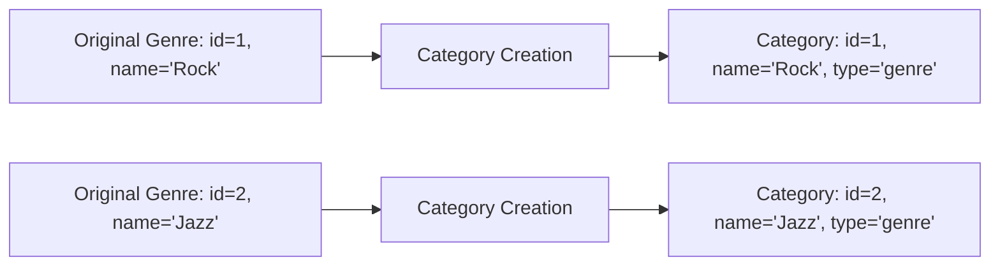
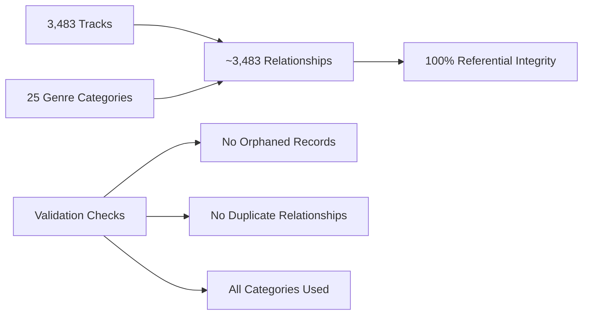

# Chinook Categorizable Seeder - Data Flow Diagram

## 🔄 Complete Data Flow Architecture

This document illustrates the complete data flow from the original Chinook SQL dump to the final polymorphic category relationships in Laravel.

## 📊 High-Level Data Flow

```mermaid
graph TB
    subgraph "Source Data"
        A[chinook.sql] --> B[Original Tracks Table]
        B --> C[track_id, name, album_id, media_type_id, genre_id, ...]
    end
    
    subgraph "Phase 1: Genre Conversion"
        D[Original Genres] --> E[ChinookGenreCategorySeeder]
        E --> F[Categories Table]
        F --> G[id=1, name='Rock', type='genre']
    end
    
    subgraph "Phase 2: Track Import"
        C --> H[ChinookTracksSeeder]
        H --> I[Tracks Table]
        I --> J[id=1, name='Track Name', metadata='{"original_genre_id": 1}']
    end
    
    subgraph "Phase 3: Relationship Creation"
        J --> K[ChinookCategorizableSeeder]
        G --> K
        K --> L[Categorizables Table]
        L --> M[category_id=1, categorizable_type='App\Models\Track', categorizable_id=1]
    end
    
    subgraph "Final Result"
        M --> N[Polymorphic Relationships]
        N --> O[Track->categories()->where('type', 'genre')]
    end
```

## 🗂️ Detailed Data Transformation

### Step 1: Original Chinook Data Structure

**Original SQL Structure:**
```sql
-- Original Chinook tracks table
CREATE TABLE tracks (
    id INTEGER PRIMARY KEY,
    name VARCHAR(200),
    album_id INTEGER,
    media_type_id INTEGER,
    genre_id INTEGER,  -- Direct foreign key to genres
    composer VARCHAR(220),
    milliseconds INTEGER,
    bytes INTEGER,
    unit_price DECIMAL(10,2)
);

-- Original Chinook genres table
CREATE TABLE genres (
    id INTEGER PRIMARY KEY,
    name VARCHAR(120)
);
```

**Sample Data:**
```sql
INSERT INTO genres VALUES (1, 'Rock');
INSERT INTO genres VALUES (2, 'Jazz');
INSERT INTO genres VALUES (3, 'Metal');

INSERT INTO tracks VALUES (1, 'For Those About To Rock', 1, 1, 1, 'Angus Young, Malcolm Young, Brian Johnson', 343719, 11170334, 0.99);
INSERT INTO tracks VALUES (2, 'Balls to the Wall', 2, 2, 1, NULL, 342562, 5510424, 0.99);
```

### Step 2: Genre to Category Conversion

**ChinookGenreCategorySeeder Process:**



**Laravel Categories Table:**
```sql
CREATE TABLE categories (
    id BIGINT PRIMARY KEY,
    name VARCHAR(255),
    type ENUM('genre', 'mood', 'theme', ...),
    parent_id BIGINT NULL,
    -- ... other fields
);
```

**Converted Data:**
```sql
INSERT INTO categories VALUES (1, 'Rock', 'genre', NULL, ...);
INSERT INTO categories VALUES (2, 'Jazz', 'genre', NULL, ...);
INSERT INTO categories VALUES (3, 'Metal', 'genre', NULL, ...);
```

### Step 3: Track Import with Metadata Preservation

**ChinookTracksSeeder Process:**

```mermaid
graph TB
    A[Original Track Data] --> B[Parse SQL Dump]
    B --> C[Extract: id=1, name='For Those About To Rock', genre_id=1]
    C --> D[Create Track Record]
    D --> E[Store Metadata: {"original_genre_id": 1}]
    E --> F[Laravel Track: id=1, metadata='{"original_genre_id": 1}']
```

**Laravel Tracks Table:**
```sql
CREATE TABLE tracks (
    id BIGINT PRIMARY KEY,
    name VARCHAR(200),
    album_id BIGINT,
    media_type_id BIGINT,
    -- NO genre_id (removed for polymorphic approach)
    composer VARCHAR(220),
    milliseconds INTEGER,
    bytes INTEGER,
    unit_price DECIMAL(10,2),
    metadata JSON,  -- Stores original_genre_id
    -- ... other fields
);
```

**Imported Data:**
```sql
INSERT INTO tracks VALUES (
    1, 
    'For Those About To Rock', 
    1, 
    1, 
    'Angus Young, Malcolm Young, Brian Johnson', 
    343719, 
    11170334, 
    0.99,
    '{"original_genre_id": 1}',  -- Preserved for relationship creation
    -- ... other fields
);
```

### Step 4: Polymorphic Relationship Creation

**ChinookCategorizableSeeder Process:**

```mermaid
graph TB
    A[Track Metadata: {"original_genre_id": 1}] --> B[Extract Mapping]
    B --> C[track_id=1, original_genre_id=1]
    
    D[Category: id=1, type='genre'] --> E[Validate Category Exists]
    
    C --> F[Create Relationship]
    E --> F
    F --> G[Categorizable Record]
    
    G --> H[category_id=1, categorizable_type='App\Models\Track', categorizable_id=1]
```

**Categorizables Table:**
```sql
CREATE TABLE categorizables (
    id BIGINT PRIMARY KEY,
    category_id BIGINT,           -- References categories.id
    categorizable_type VARCHAR(255), -- 'App\Models\Track'
    categorizable_id BIGINT,      -- References tracks.id
    sort_order INT DEFAULT 0,
    metadata JSON,
    created_at TIMESTAMP,
    updated_at TIMESTAMP
);
```

**Final Relationship Data:**
```sql
INSERT INTO categorizables VALUES (
    1,
    1,                           -- category_id (Rock genre)
    'App\Models\Track',         -- categorizable_type
    1,                          -- categorizable_id (track id)
    1,                          -- sort_order (primary genre)
    '{"is_primary": true, "source": "chinook_import", "confidence": 1.0, "original_genre_id": 1}',
    NOW(),
    NOW()
);
```

## 🔍 Data Mapping Examples

### Example 1: Rock Track

**Original Chinook:**
```sql
-- Genre
INSERT INTO genres VALUES (1, 'Rock');

-- Track
INSERT INTO tracks VALUES (1, 'For Those About To Rock', 1, 1, 1, 'Angus Young, Malcolm Young, Brian Johnson', 343719, 11170334, 0.99);
```

**Laravel Result:**
```sql
-- Category
INSERT INTO categories VALUES (1, 'Rock', 'genre', NULL, ...);

-- Track (with metadata)
INSERT INTO tracks VALUES (1, 'For Those About To Rock', 1, 1, 'Angus Young, Malcolm Young, Brian Johnson', 343719, 11170334, 0.99, '{"original_genre_id": 1}', ...);

-- Categorizable Relationship
INSERT INTO categorizables VALUES (1, 1, 'App\Models\Track', 1, 1, '{"is_primary": true, "source": "chinook_import", "confidence": 1.0, "original_genre_id": 1}', NOW(), NOW());
```

**Laravel Usage:**
```php
$track = Track::find(1);
$genres = $track->categories()->where('type', 'genre')->get();
// Returns: Collection with 'Rock' category
```

### Example 2: Jazz Track

**Original Chinook:**
```sql
-- Genre
INSERT INTO genres VALUES (2, 'Jazz');

-- Track
INSERT INTO tracks VALUES (2, 'Miles Runs the Voodoo Down', 8, 1, 2, 'Miles Davis', 875000, 14067307, 0.99);
```

**Laravel Result:**
```sql
-- Category
INSERT INTO categories VALUES (2, 'Jazz', 'genre', NULL, ...);

-- Track (with metadata)
INSERT INTO tracks VALUES (2, 'Miles Runs the Voodoo Down', 8, 1, 'Miles Davis', 875000, 14067307, 0.99, '{"original_genre_id": 2}', ...);

-- Categorizable Relationship
INSERT INTO categorizables VALUES (2, 2, 'App\Models\Track', 2, 1, '{"is_primary": true, "source": "chinook_import", "confidence": 1.0, "original_genre_id": 2}', NOW(), NOW());
```

## 📈 Relationship Statistics

### Expected Data Volumes

| Entity | Count | Description |
|--------|-------|-------------|
| Original Genres | 25 | Rock, Jazz, Metal, etc. |
| Genre Categories | 25 | Converted to CategoryType::GENRE |
| Tracks | 3,483 | All tracks from Chinook |
| Track-Genre Relationships | ~3,483 | One primary genre per track |
| Tracks without Genres | ~0-50 | Some tracks may lack genre data |

### Relationship Integrity



## 🔧 Technical Implementation Details

### Metadata Structure

Each categorizable relationship includes rich metadata:

```json
{
    "is_primary": true,
    "source": "chinook_import",
    "confidence": 1.0,
    "original_genre_id": 1,
    "import_timestamp": "2024-01-15T14:30:25Z"
}
```

### Performance Optimizations

1. **Batch Processing**: 200 relationships per batch
2. **Index Usage**: Leverages database indexes for fast lookups
3. **Memory Management**: Automatic garbage collection
4. **Validation Caching**: Pre-validates all mappings

### Error Handling

1. **Missing Tracks**: Skip relationships for non-existent tracks
2. **Missing Categories**: Skip relationships for non-existent categories
3. **Duplicate Detection**: Check existing relationships before insertion
4. **Transaction Safety**: All operations wrapped in transactions

## 🎯 Usage Patterns

### Common Queries

```php
// Get all rock tracks
$rockTracks = Track::whereHas('categories', function ($query) {
    $query->where('type', 'genre')->where('name', 'Rock');
})->get();

// Get track's primary genre
$track = Track::find(1);
$primaryGenre = $track->categories()
    ->where('type', 'genre')
    ->whereJsonContains('categorizables.metadata->is_primary', true)
    ->first();

// Get genre usage statistics
$genreStats = Category::where('type', 'genre')
    ->withCount(['tracks' => function ($query) {
        $query->where('categorizable_type', 'App\Models\Track');
    }])
    ->get();
```

### Advanced Relationships

```php
// Tracks with multiple genres (future enhancement)
$track->categories()->where('type', 'genre')->get();

// Genre hierarchy (if parent-child relationships exist)
$category->children()->where('type', 'genre')->get();

// Cross-category analysis
$track->categories()->whereIn('type', ['genre', 'mood', 'theme'])->get();
```
